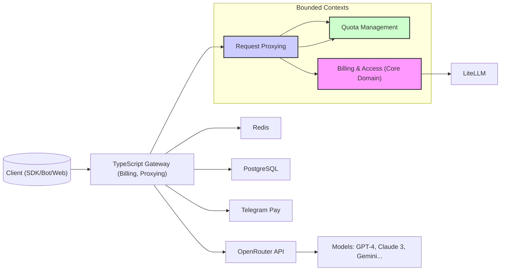

# LLM Gateway

**LLM Gateway** is an API proxy service designed for the CIS market, providing unified access to leading large language models (LLMs) like GPT-4, Claude 3, Mistral, and Gemini. It features transparent token-based billing, Telegram Pay integration, and a simple SDK for quick integration.

## Features

- **Unified API Access**: Connect to multiple LLMs through a single, OpenAI-compatible API endpoint.
- **Transparent Billing**: Pay for what you use with clear token-based billing.
- **Telegram Pay Integration**: Convenient top-ups via Telegram Pay (initial MVP).
- **API Key Management**: Secure generation and management of API keys with quotas.
- **Rate Limiting**: Protects the system from abuse and ensures fair usage.
- **Developer-Friendly**: Simple SDK and comprehensive documentation for quick start.

## Architecture



## Getting Started

### Prerequisites

- [Bun](https://bun.sh/) v1.1.5 or later
- Docker and Docker Compose

### Installation

1.  Clone the repository:
    ```bash
    git clone git@github.com:jefo/llmrouter.git
    cd llmrouter
    ```
2.  Install dependencies using Bun:
    ```bash
    bun install
    ```
3.  Set up environment variables (e.g., for PostgreSQL, Redis, OpenRouter API keys).

### Running the Project

To run the development server:

```bash
bun run index.ts
```

To start the full stack with Docker Compose (including LiteLLM, PostgreSQL, Redis):

```bash
docker-compose up -d
```

## Documentation

Detailed engineering and product documentation can be found in the `docs/` directory:

- [`docs/domain.md`](./docs/domain.md): Domain Model Documentation
- [`docs/ProductBacklog.md`](./docs/ProductBacklog.md): Product Backlog
- [`docs/application_layer.md`](./docs/application_layer.md): Application Layer Design
- [`docs/technical.md`](./docs/technical.md): Technical Overview

## Contributing

We welcome contributions! Please see our [Contributing Guidelines](CONTRIBUTING.md) (coming soon) for more details.

## License

This project is licensed under the MIT License - see the [LICENSE](LICENSE) file for details.

## Contact

For any inquiries, please open an issue on GitHub or contact [your-email@example.com](mailto:your-email@example.com).
