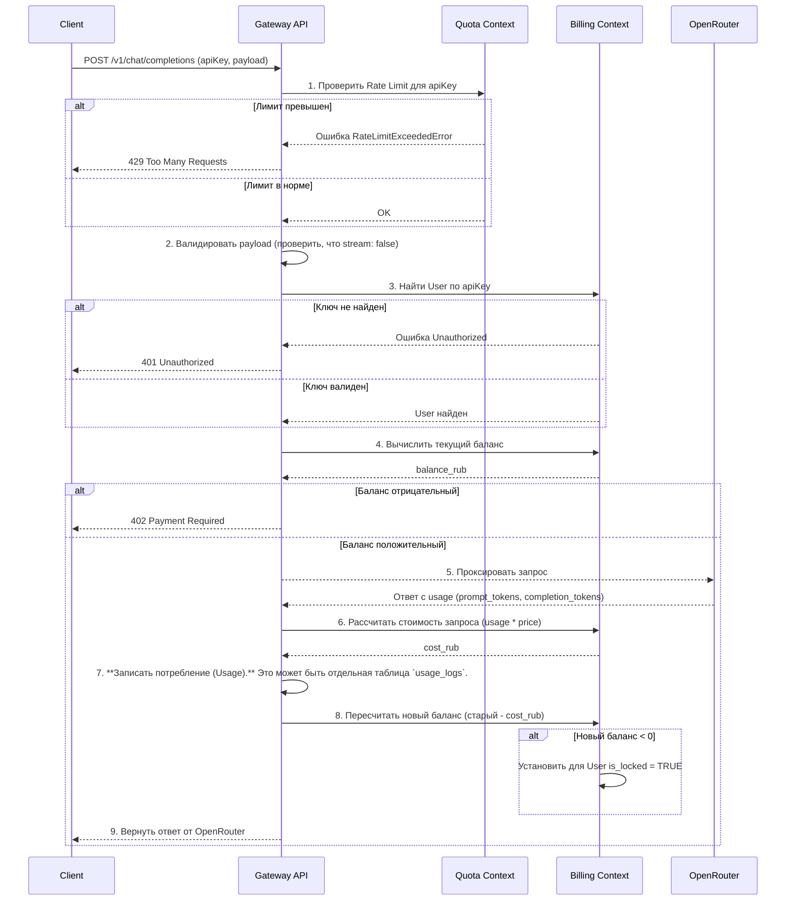

# 4. Диаграммы сложных потоков

## 4.1. Поток "Проксирование запроса к LLM"

Этот поток показывает все проверки, которые проходит запрос пользователя.

```mermaid
sequenceDiagram
    participant C as Client
    participant GW as Gateway API
    participant Quota as Quota Context
    participant Billing as Billing Context
    participant OR as OpenRouter

    C->>GW: POST /v1/chat/completions (apiKey, payload)
    GW->>Quota: 1. Проверить Rate Limit для apiKey
    alt Лимит превышен
        Quota-->>GW: Ошибка RateLimitExceededError
        GW-->>C: 429 Too Many Requests
    else Лимит в норме
        Quota-->>GW: OK
    end
    GW->>GW: 2. Валидировать payload (проверить, что stream: false)
    GW->>Billing: 3. Найти User по apiKey
    alt Ключ не найден
        Billing-->>GW: Ошибка Unauthorized
        GW-->>C: 401 Unauthorized
    else Ключ валиден
        Billing-->>GW: User найден
    end
    GW->>Billing: 4. Вычислить текущий баланс
    Billing-->>GW: balance_rub
    alt Баланс отрицательный
        GW-->>C: 402 Payment Required
    else Баланс положительный
        GW-->>OR: 5. Проксировать запрос
        OR-->>GW: Ответ с usage (prompt_tokens, completion_tokens)
        GW->>Billing: 6. Рассчитать стоимость запроса (usage * price)
        Billing-->>GW: cost_rub
        GW->>GW: 7. **Записать потребление (Usage).** Это может быть отдельная таблица `usage_logs`.
        GW->>Billing: 8. Пересчитать новый баланс (старый - cost_rub)
        alt Новый баланс < 0
            Billing->>Billing: Установить для User is_locked = TRUE
        end
        GW-->>C: 9. Вернуть ответ от OpenRouter
    end
```
