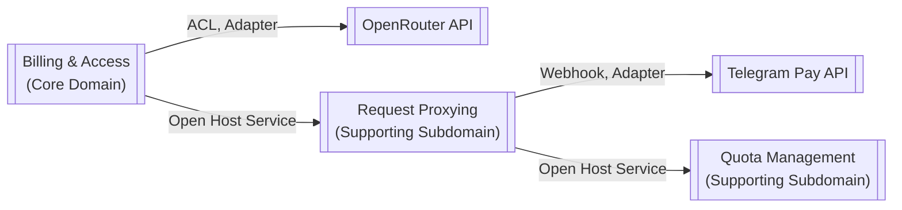

# Domain Model Documentation

## 1. Ubiquitous Language (Единый Язык)

- **User**: Клиент сервиса, идентифицируемый через Telegram ID. Является владельцем API-ключей и Транзакций.
- **ApiKey**: Учетные данные для аутентификации запросов к Шлюзу. Жизненный цикл: создан, активен, отозван.
- **Gateway**: Наше приложение - единая точка доступа к Провайдеру.
- **Provider**: Внешний сервис, предоставляющий LLM (OpenRouter).
- **Transaction**: Неизменяемая запись о финансовой операции (в MVP только Пополнения).
- **Usage**: Запись о количестве использованных токенов и их стоимости (запрашивается у Провайдера).
- **Balance**: Вычисляемое значение: Σ(Пополнения) - Σ(Потребление).
- **Money**: Value Object, представляющий денежную сумму с валютой.
- **Quota**: Сущность, представляющая политику частоты запросов и текущее состояние лимитов для клиента.

## 2. Bounded Contexts (Ограниченные Контексты)

### 2.1. Core Domain: "Billing & Access Context"

**Responsibilities**:
- Управление жизненным циклом Users и API-ключей
- Обработка Transactions
- Расчет Balance
- Авторизация запросов

**Key Entities**:
- User
- ApiKey 
- Transaction

**Key Services**:
- BalanceCalculator

### 2.2. Supporting Subdomain: "Quota Management Context"

**Responsibilities**:
- Обеспечение соблюдения политик частоты запросов для защиты системы от перегрузок и злоупотреблений.

**Key Entities**:
- Quota

## 3. Context Map

**Relationships**:
- **Billing & Access -> Request Proxying**: Customer-Supplier
- **Billing & Access <-> OpenRouter API**: Anti-Corruption Layer (ACL)
- **Request Proxying <-> Telegram Pay API**: Adapter/Webhook
- **Request Proxying -> Quota Management**: Customer-Supplier. Контекст проксирования обращается к контексту управления квотами перед тем, как обратиться к биллингу, чтобы выполнить fail-fast.

## 4. Core Domain Design: Billing & Access Context

### Aggregates

#### User Aggregate
- **Root**: User (identified by UserId)
- **Entities**: ApiKey (controlled by User)
- **Behavior**:
  - `generateApiKey()` → Publishes ApiKeyGenerated event
  - `revokeApiKey(apiKeyId)` → Publishes ApiKeyRevoked event
- **Boundary**: Atomic changes to User and its keys

#### Transaction Aggregate  
- **Root**: Transaction (identified by TransactionId)
- **State**: UserId, Amount (Money), Timestamp, Status
- **Boundary**: Each transaction is atomic and independent

#### Quota Aggregate
- **Root**: Quota (identified by ClientId, which is a string representation of ApiKey)
- **State**:
  - `policy`: `{ threshold: number, windowSeconds: number }` — Политика (неизменяемая).
  - `attempts`: `number` — Текущее число попыток.
  - `windowStartUnixTime`: `number` — Время начала окна в Unix time.
- **Behavior**:
  - `assertCanMakeRequest()`:
    - Получить текущее время `now`.
    - Если `now > windowStartUnixTime + windowSeconds`, значит, окно истекло. Сбросить `attempts` в 1, обновить `windowStartUnixTime` на `now`. Вернуть `void`.
    - Если окно не истекло:
      - Если `attempts >= policy.threshold`, выбросить доменное исключение `RateLimitExceededError`.
      - В противном случае, инкрементировать `attempts`.

### Domain Services

#### BalanceCalculator
- **Purpose**: Implements "Balance is calculated on-the-fly"
- **Method**: `calculateFor(userId: UserId): Money`

### Repository Contracts

- `IUserRepository`:
  - `findById(userId)`
  - `findByTelegramId(telegramId)`
  - `save(user: User)`
  
- `ITransactionRepository`:
  - `save(transaction: Transaction)`
  - `getTotalTopUpAmount(userId: UserId): Money`
  
- `IUsageRepository`:
  - `getTotalUsageAmount(userId: UserId, dateRange: DateRange): Money`

- `IQuotaRepository`:
  - `findById(clientId: string): Promise<Quota | null>`
  - `save(quota: Quota): Promise<void>`

## 5. Architecture Alignment (Hexagonal/Clean)

- **Domain Layer**: Aggregates, services, events (no dependencies)
- **Application Layer**: Use cases (TopUpBalanceUseCase etc.)
  - **ProxyChatCompletionUseCase**:
    - **Purpose**: Оркестрирует взаимодействие между контекстами для обработки запросов на завершение чата.
    - **Dependencies** (внедряются через конструктор):
      - `checkAndRecordUsageUseCase`: `CheckAndRecordUsageUseCase` (из контекста "Управление Квотами")
      - `IUserRepository`
      - `BalanceCalculator`
      - `LlmRouter`
    - **Main Scenario**:
      1. Получить `apiKey` из команды.
      2. **(Шаг 1: Проверка лимитов)** Вызвать `checkAndRecordUsageUseCase.execute({ clientId: apiKey })`. Внутренняя логика `checkAndRecordUsage`: находит `Quota` (или создает новую), вызывает `quota.assertCanMakeRequest()` и сохраняет. Если выброшено исключение `RateLimitExceededError`, оно пробрасывается наружу и сценарий завершается с ошибкой `429 Too Many Requests`.
      3. **(Шаг 2: Проверка ключа)** Найти Пользователя по `apiKey` (`IUserRepository.findByApiKey`). Если не найден — ошибка `401 Unauthorized`.
      4. **(Шаг 3: Проверка баланса)** Вызвать `balance = balanceCalculator.calculateFor(user.id)`. Если `balance <= 0` — ошибка `402 Payment Required`.
      5. **(Шаг 4: Проксирование)** Передать запрос в `LlmRouter.forwardRequest()`.
      6. Вернуть ответ.

- **Infrastructure Layer**:
  - `PostgresUserRepository`, `PostgresTransactionRepository`
  - `OpenRouterUsageRepository`
  - `OpenRouterAdapter`, `TelegramPayAdapter`
  - `RedisQuotaRepository`: Реализует `IQuotaRepository`. Этот класс будет содержать всю логику работы с Redis. Метод `save(quota)` будет использовать транзакцию Redis (`MULTI`/`EXEC`) для атомарного обновления счетчика и времени жизни ключа (`INCR`, `EXPIRE`).